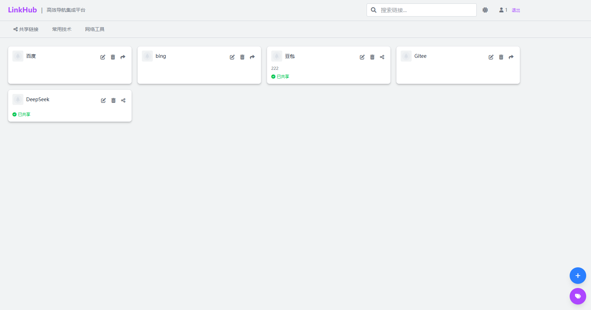

# LinkHub智能导航聚合平台

## 📖 项目简介

**LinkHub** 是一个基于 Spring Boot 3.x 构建的现代化智能导航聚合平台，专为技术人员、团队和企业设计。平台采用多租户架构，支持分类管理、链接管理、智能搜索、链接共享等核心功能，为用户提供高效、美观、个性化的网址导航服务。

### 🎯 项目由来
作为一名技术人员，平常收藏的技术资源较多，之前一直保存在浏览器标签中。浏览器的缺陷是无法跨设备同步，且网上现有的标签管理工具用着总感觉不够顺手。因此决定自己开发一个功能简洁、体验优秀的导航平台，既能实现个人链接管理，又能将优质资源分享给更多人。



## ✨ 核心功能特性

### 🔗 智能链接管理
- **分类体系**: 支持多级分类结构，灵活组织您的收藏链接
- **标签系统**: 为链接添加标签，实现多维度的资源分类
- **链接预览**: 自动获取网站图标和描述信息


### 🌐 链接共享生态
- **一键共享**: 将个人收藏的优质链接分享到公共区域
- **共享分类**: 专门的共享链接分类，汇聚全网优质资源
- **复制收藏**: 一键复制他人共享的链接到个人分类
- **来源追踪**: 记录链接的原始分享者和分享时间
- **权限控制**: 灵活的共享权限管理

### 🎨 个性化体验
- **主题切换**: 支持明暗主题切换，护眼更舒适
- **布局定制**: 多种布局模式，满足不同使用习惯
- **响应式设计**: 完美适配桌面端、平板和移动端

### 🔐 安全与权限
- **多租户架构**: 支持数据隔离和权限控制
- **用户认证**: 基于 Sa-Token 的安全认证系统
- **角色权限**: 细粒度的权限控制和管理
- **数据加密**: 敏感数据加密存
- **多存储支持**: 本地存储、阿里云OSS、腾讯云COS等


## 🏗️ 技术架构

### 核心技术栈
- **后端框架**: Spring Boot 3.4.3 + Spring Security
- **Java版本**: JDK 17 (LTS)
- **构建工具**: Maven 3.11.0
- **数据库**: MySQL 8.0+ (支持 MyBatis-Plus)
- **缓存系统**: Redis 6.0+
- **权限认证**: Sa-Token 1.37+
- **前端模板**: FreeMarker 3.0+
- **CSS框架**: Tailwind CSS 4.1.10
- **图标库**: Font Awesome 6.0.0

### 架构特点
- **微服务就绪**: 基于 Spring Boot 的架构设计
- **模块化设计**: Maven 多模块架构，职责分离清晰
- **多租户架构**: 支持数据隔离和权限控制
- **插件化扩展**: 文件存储、短信服务等功能的插件化扩展


## 📁 项目结构

```
zeus-nav/
├── zeus-admin/                    # 主应用模块
│   ├── src/main/java/
│   │   └── com/qishanor/
│   │       ├── AdminApplication.java    # 主启动类
│   │       ├── controller/              # 控制器层
│   │       │   ├── CategoryController.java    # 分类管理
│   │       │   ├── FileController.java        # 文件管理
│   │       │   ├── IndexController.java       # 首页控制器
│   │       │   ├── LinkController.java        # 链接管理
│   │       │   ├── SmsController.java         # 短信服务
│   │       │   └── UserController.java        # 用户管理
│   │       ├── entity/                # 实体类
│   │       │   ├── Category.java            # 分类实体
│   │       │   ├── Link.java                # 链接实体
│   │       │   ├── SysUser.java             # 用户实体
│   │       │   └── vo/                      # 视图对象
│   │       ├── framework/             # 框架配置
│   │       │   ├── ApplicationDataLoader.java # 应用数据加载器
│   │       │   ├── CacheConfig.java          # 缓存配置
│   │       │   └── util/                     # 工具类
│   │       ├── mapper/                # 数据访问层
│   │       │   ├── CategoryMapper.java       # 分类数据访问
│   │       │   ├── LinkMapper.java           # 链接数据访问
│   │       │   └── SysUserMapper.java        # 用户数据访问
│   │       └── Service/               # 业务逻辑层
│   │           ├── CategoryService.java      # 分类服务
│   │           ├── LinkService.java          # 链接服务
│   │           ├── SysUserService.java       # 用户服务
│   │           └── impl/                     # 服务实现
│   └── src/main/resources/
│       ├── application.yml           # 应用配置
│       ├── templates/front/          # 前端模板
│       │   └── index.ftl            # 首页模板
│       └── static/                   # 静态资源
│           ├── css/                  # 样式文件
│           ├── js/                   # JavaScript文件
│           └── image/                # 图片资源
├── zeus-common/                     # 公共模块
│   ├── zeus-common-bom/             # 依赖版本管理
│   ├── zeus-common-core/            # 核心工具包
│   │   └── src/main/java/
│   │       └── com/qishanor/common/core/
│   │           ├── constant/         # 常量定义
│   │           ├── exception/        # 异常处理
│   │           └── util/             # 工具类
│   ├── zeus-common-data/            # 数据访问模块
│   │   └── src/main/java/
│   │       └── com/qishanor/common/data/
│   │           ├── mybatis/          # MyBatis配置
│   │           └── tenant/           # 多租户支持
│   ├── zeus-common-oss/             # 文件存储模块
│   │   └── src/main/java/
│   │       └── com/qishanor/common/file/
│   │           ├── engine/           # 存储引擎
│   │           └── repository/       # 配置仓库
│   ├── zeus-common-security/        # 安全认证模块
│   │   └── src/main/java/
│   │       └── com/qishanor/common/security/
│   │           ├── SaTokenConfiguration.java  # Sa-Token配置
│   │           └── StpInterfaceImpl.java      # 权限接口实现
│   └── zeus-common-sms/             # 短信服务模块
│       └── src/main/java/
│           └── com/qishanor/common/sms/
│               ├── engine/           # 短信引擎
│               ├── log/              # 短信日志
│               └── repository/       # 配置仓库
└── pom.xml                          # 父级POM文件
```

## 🚀 快速开始

### 环境要求
- **JDK**: 17+ (推荐使用 LTS 版本)
- **Maven**: 3.11.0+
- **MySQL**: 8.0+ (推荐 8.0.28+)

### 安装步骤


#### 1. 克隆项目
```bash
git clone https://gitee.com/qishanor/zeus-nav.git
cd zeus-nav
```

#### 2. 数据库配置
```sql
-- 创建数据库
CREATE DATABASE zeus_nav_dev CHARACTER SET utf8mb4 COLLATE utf8mb4_unicode_ci;

-- 导入初始数据
navicat工具中导入doc/zeus_nav_dev.sql文件

```

#### 3. 应用配置
修改 `zeus-admin/src/main/resources/application-dev.yml`:
```yaml
spring:
  datasource:
    url: jdbc:mysql://localhost:3306/zeus_nav_dev?useUnicode=true&characterEncoding=utf8&serverTimezone=Asia/Shanghai
    username: your_username
    password: your_password
  

# 文件存储配置
file:
  storage:
    type: local  # local, aliyun, tencent
    local:
      path: /path/to/upload
    #aliyun:
      #endpoint: your_endpoint
      #accessKey: your_access_key
      #secretKey: your_secret_key
      #bucketName: your_bucket
```

#### 4. 启动应用

- **前端地址**: http://localhost:8008
- **默认端口**: 8008 (可在配置文件中修改)


## 🤝 贡献指南

### 贡献流程
1. **Fork项目**: Fork本仓库到你的GitHub账户
2. **创建分支**: 创建特性分支 (`git checkout -b feature/AmazingFeature`)
3. **提交更改**: 提交你的更改 (`git commit -m 'Add some AmazingFeature'`)
4. **推送到分支**: 推送更改到你的分支 (`git push origin feature/AmazingFeature`)
5. **创建PR**: 创建Pull Request并描述你的更改


## 📄 开源协议

本项目采用 [GPL 协议](./LICENSE) 开源协议，详情请查看协议文件。


**LinkHub** - 让网址导航更简单、更高效、更智能！ 🚀

*如果你觉得这个项目对你有帮助，请给我们一个⭐️ Star！*


